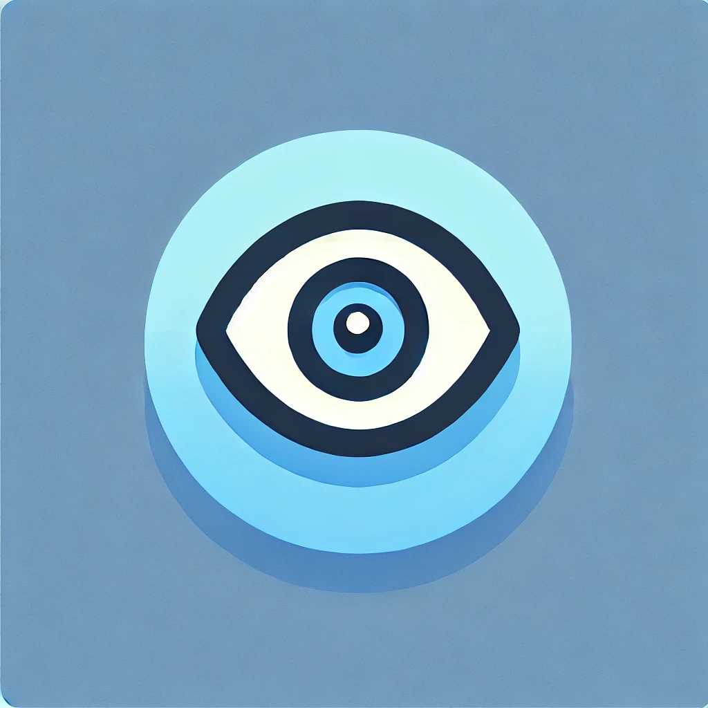

# Kanshi Bot

<!--suppress CheckImageSize -->

    
    

    <i>The artwork is <del>self-made</del> created by AI</i>

## Functionality

This bot logs message edits and deletions to `env:LOG_CHANNEL`.

For those who are interested, the bots name originates from:
監視 (monitoring, watching, surveillance).